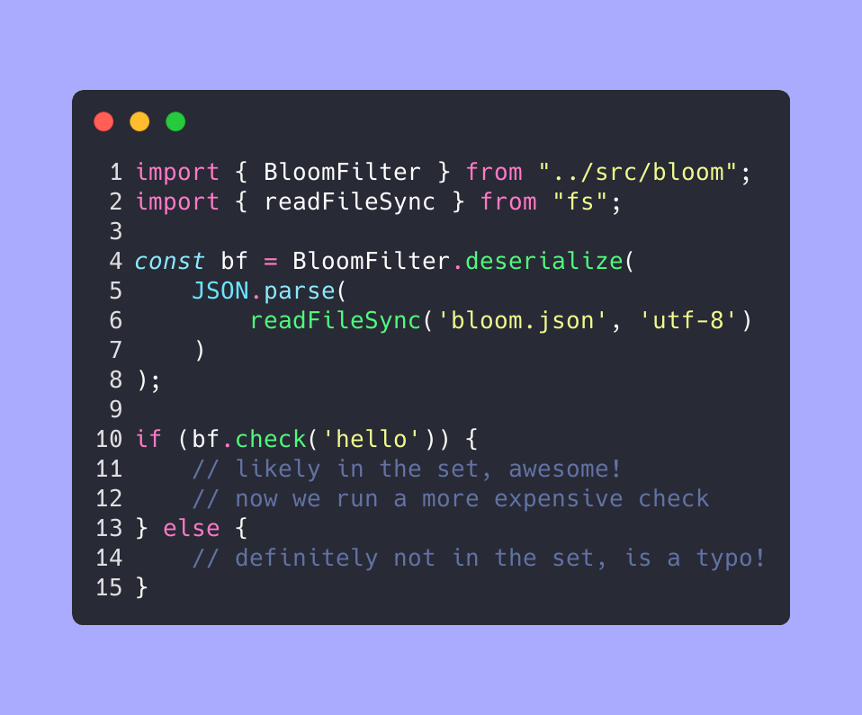

# TypeScript spellcheck bloom filter



Implementation of a bloom filter in TypeScript with the indended purpose of spellchecking. A bloom filter is a probabilistic data structure which can be used to determine if an element likely is in a set, or definitely is not in a set. This can be used to avoid performing expensive lookups, such as searching for a single word in a large list of words.

## Description

Simplistic implementation of a bloom filter for spellchecking in TypeScript, using the murmur3 hash function, a dictionary file and simple serialization/deserialization of the bloom filter.

For the linked dictionary of 467k files, the resulting JSON is roughly 1.1MB raw, or roughly 621k gzipped, with a false positive rate setting of 1%. Generating the file takes roughly 2 seconds on an Apple M2 Max CPU. Benchmark script reports roughly 280 kops/s when looking up a word.

This is not released as a library on purpose, as there are many other implementatitons of bloom filters and spellchecking with bloom filters is quite a limited approach, but still viable as a first-pass step for more expensive spell-checking functions.

Future versions may be more focused on performance, smaller file sizes and more extensive methods for spellchecking.

## Getting Started

### Dependencies

* developed on Node v21.7.1
* all requirements are listed in package.json, all apart from tsx are related to testing, and not necesasry.

### Installing

* clone this project `git clone https://github.com/kdouda/spellcheck-bloomfilter.git`
* install dependencies `npm i`

### Executing program

* download the word list you want to fill the dictionary with into the root directory of this repository
* generate the bloom filter using `npm run generate`
* this should create a large JSON file `bloom.json`
* this JSON file can be then imported using the following code:

```ts
const bf = BloomFilter.deserialize(
    JSON.parse(
        readFileSync('bloom.json', 'utf-8')
    )
);

if (bf.check('hello')) {
    // likely in the set, awesome!
} else {
    // definitely not in the set, is a typo!
}
```

### Benchmarking

* a benchmark can be run using the `npm run benchmark` script

## Version History

* 0.1
  * Initial Release

## License

This project is licensed under the MIT license. But if you for any reason use this, please do let me know, I'd love to know!

## Acknowledgments

* [murmurhash-js](https://github.com/garycourt/murmurhash-js/blob/master/murmurhash3_gc.js) for the implementation of murmur3 in JavaScript
* [Coding Challenge by John Crickett](https://substack.com/@johncrickett) for the idea
* [english-words](https://github.com/dwyl/english-words) for the dictionary file

## Lessons learnt

* implementing hash functions is hard, don't do it
* tdd is okay
